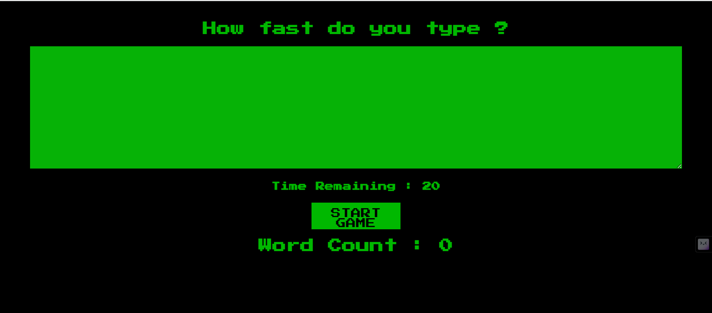
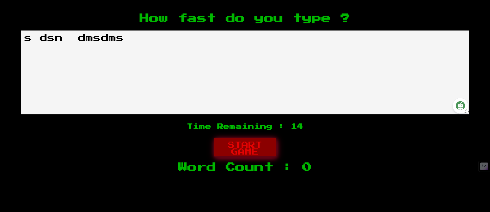

# WordTrackr

> "Counting words to shape your thoughts."

 




## Installation

1. Clone the repository:

   ```bash
   git clone https://github.com/MehraDevesh2022/WordTrackr.git
   cd WordTrackr
 
    ```
2. Install the dependencies:

   ```bash
   npm install
   ```
3. Start the server:

   ```bash
    npm start
    ```

## Usage
 
1. Open the browser and go to http://localhost:3000/
2. Enter the text in the text area.
3. Click on the "Count Words" button.
4. The word count will be displayed in the table below.

## Contributing
    
Contributions are always welcome!

